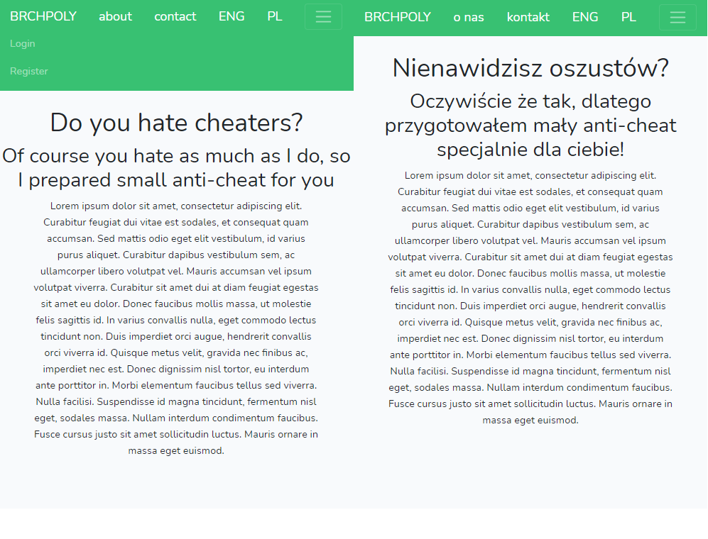
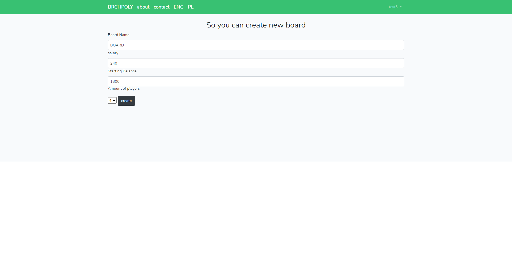
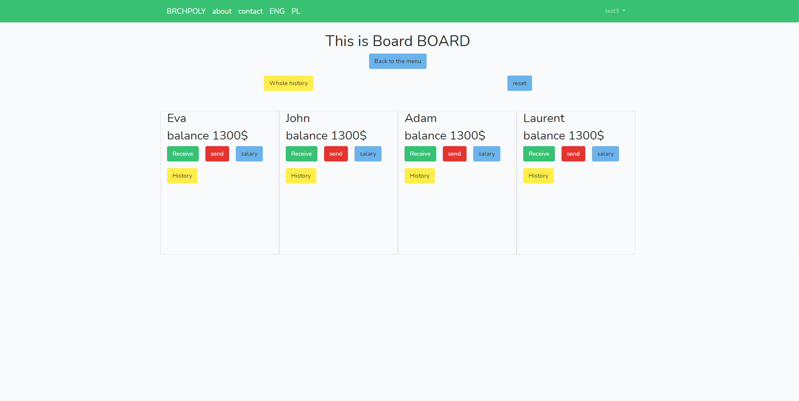
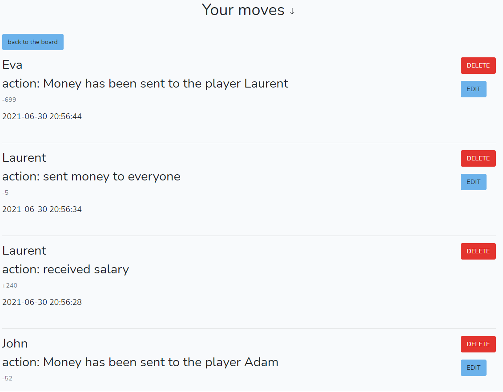
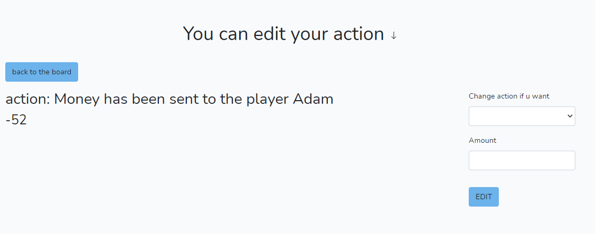

<h1>Monopoly Anti-cheat</h1>
<h4>It's my first project in laravel. It's literally  monopoly anti-cheat. What do I mean by that? Everyone knows this feeling when you're playing monopoly with friends and somebody starts cheating it's really frustrating. So I prepared small application which allows you to create account and make boards. In those boards you can save every action which happens in the game, you can also rollback and edit them.There is also simple settings panel in this project I mean you can change your password or just delete your account. There is also a very usefull feature it's language switching</h4>
<h2>I'll show here the most important panels</h2>

<h2>There is a very simple creator</h2>

<h4>So it's a main panel where you can reset, make any action or open whole history or even history of choosen player</h4>

<h4>Screenshot of the history panel</h4>

<h4>Screenshot of the editor panel</h4>

<h6>btw of course I'm using bootstrap</h6>
  
